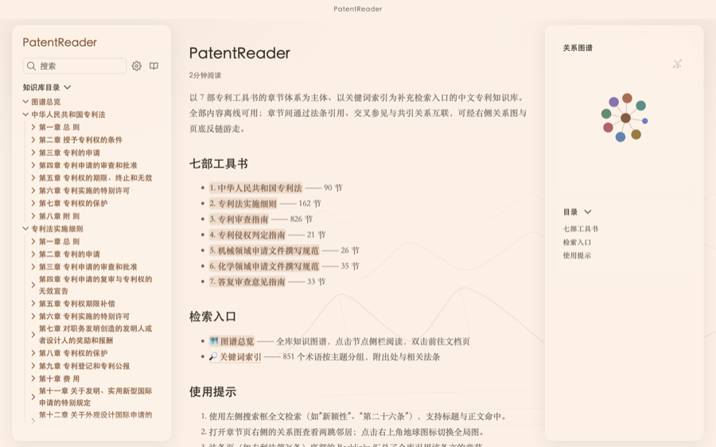
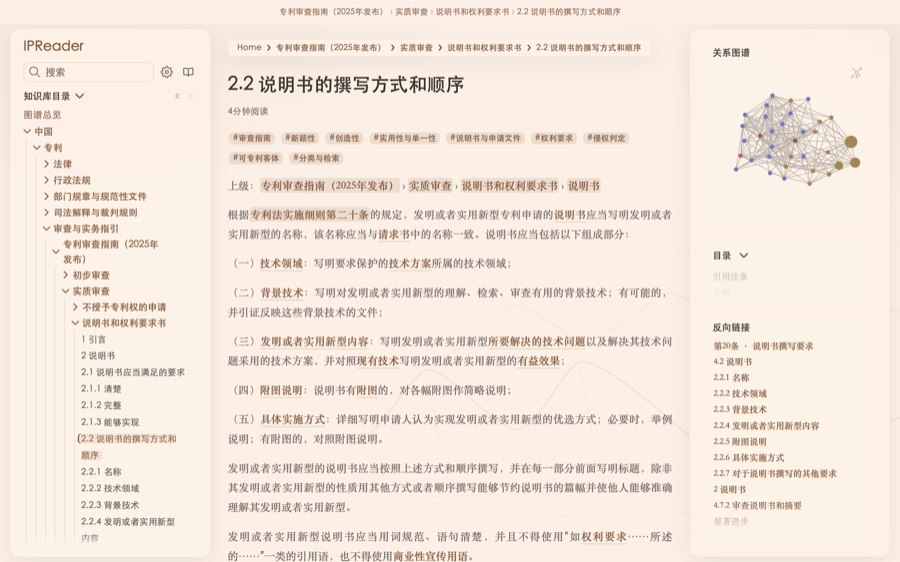
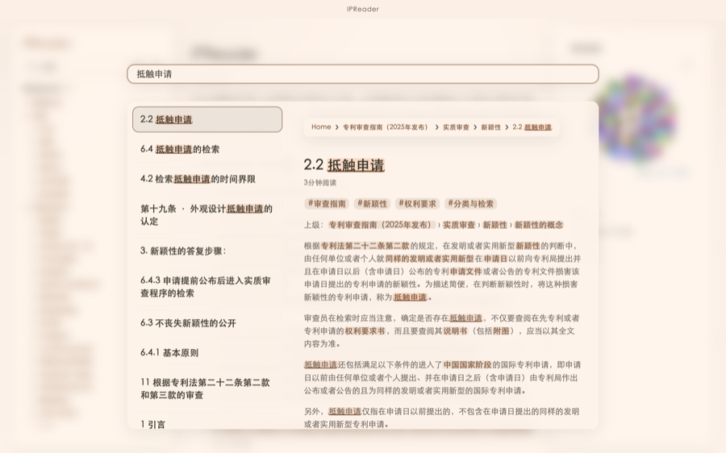
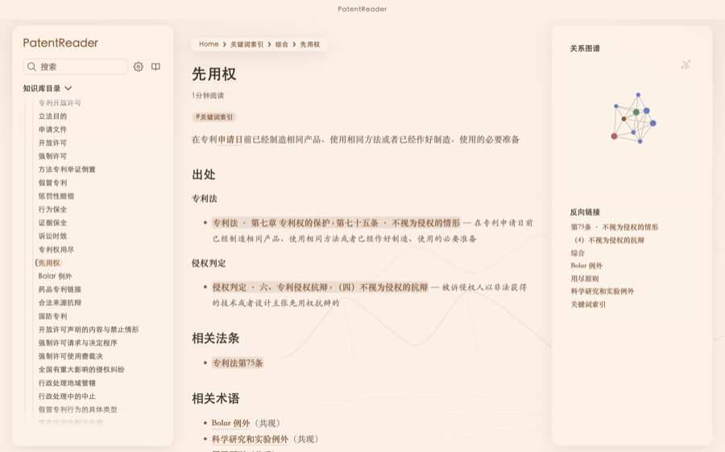
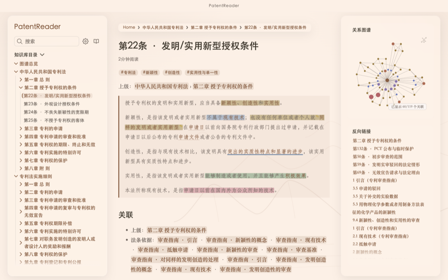
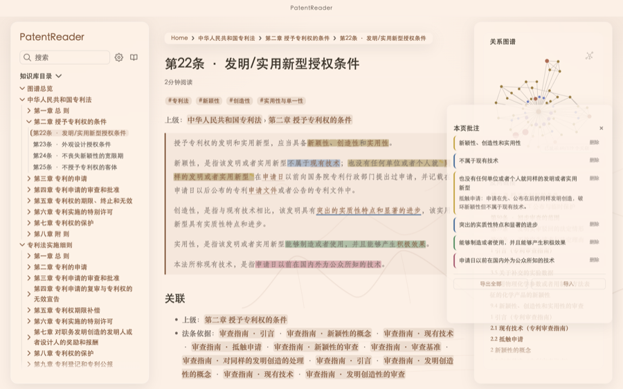
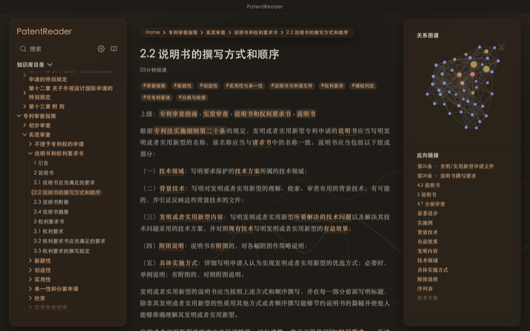
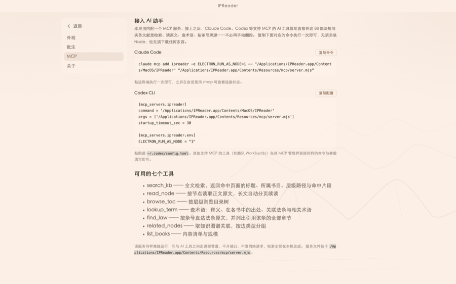

# IPReader

> 面向知识产权实务的本地优先知识库桌面应用

IPReader 将知识产权法规、司法解释与实务规范整理为一套可检索、可追溯、可批注的离线阅读工具。应用不依赖账号和云端服务，正文、术语、法条引用与知识图谱均随安装包保存在本机。

[下载最新版本](https://github.com/Chin-Jing1998/IPReader/releases) · [使用说明](使用说明.md) · [内容许可](CONTENT_LICENSE.md) · [安全说明](SECURITY.md)

## 项目定位

IPReader 面向需要长期查阅知识产权规范文件的专利代理师、企业知识产权人员、法务人员、研发团队与研究者，重点解决三个问题：

- **查得快**：全文搜索、关键词索引与按条号定位，将分散在多部文件中的信息集中到一个本地入口；
- **看得懂**：目录树、章节层级、术语释义与法条引用互相连接，支持从概念回到原文；
- **留得住**：高亮、划线、笔记与阅读进度只保存在本机，可导出、导入和落盘为 Markdown。

## 内容规模

以下为 **2026 年 8 月 30 日**的数据快照：

| 指标         |          规模 | 说明                                   |
| ------------ | ------------: | -------------------------------------- |
| 收录文献     |     **76 部** | 主干文献 7 部，扩展文献 69 部          |
| 正文页       |  **5,963 页** | 法规、司法解释、指南与实务规范正文     |
| 术语词条     |  **1,743 个** | 按 41 个主题分组，含释义、出处与关联项 |
| 图谱节点     |  **7,706 个** | 文献、章节、小节与术语节点             |
| 图谱关系     | **19,099 条** | 层级、引用、术语与关联关系             |
| 法条溯源     |  **2,409 条** | 覆盖 65 部法律法规的条文正文           |
| 法条引用关系 |  **2,983 条** | 支持从法条反查引用它的章节             |
| 行内术语链接 | **27,659 处** | 正文中的术语可直接跳转词条             |

### 主干文献

| 文献                     | 规模                          | 来源                       |
| ------------------------ | ----------------------------- | -------------------------- |
| 中华人民共和国专利法     | 82 条                         | 全国人民代表大会常务委员会 |
| 专利法实施细则           | 149 条                        | 国务院                     |
| 专利审查指南（2025）     | 6 部、38 章、259 节、523 小节 | 国家知识产权局             |
| 专利侵权判定指南（2017） | 153 条                        | 北京市高级人民法院         |
| 机械领域申请文件撰写规范 | 2 章、18 节                   | 自撰 / 已获授权            |
| 化学领域申请文件撰写规范 | 2 章、26 节                   | 自撰 / 已获授权            |
| 审查意见答复指引         | 7 章、26 节                   | 自撰 / 已获授权            |

### 扩展文献

扩展文献共 **69 部**，其中包括：

- **26 部**司法解释与最高人民法院知识产权法庭裁判要旨；
- **43 部**法律、行政法规、部门规章与其他规范性文件，涵盖商标、著作权、反垄断、反不正当竞争、植物新品种、集成电路布图、海关保护及知识产权管理等主题。

知识图谱展示全部 76 部文献——2026 年 8 月起，原先仅保留在正文与搜索中、不参与图谱绘制的政策与标准索引文件已整体下线归档，正文、目录、搜索与图谱四者的书目范围自此一致。

## 核心功能

### 阅读、检索与溯源

- **全文搜索**：标题和正文均可检索，命中片段支持实时预览；
- **三级目录**：按「中国 → 权利类型 → 文件归类」组织文献，末级文献直接进入正文；
- **法条溯源**：正文中的法条引用可跳转原文，法条页反向列出引用章节；
- **术语索引**：词条包含释义、出处、关联法条和相关术语，正文中的术语自动成链；
- **翻页与进度**：支持键盘翻页、目录自动定位和阅读进度环。

### 全库知识图谱

- 节点按文献和法域着色，层级节点与术语节点分层展示；
- 支持缩放、拖拽、节点搜索定位和一键重置视图；
- 支持按专利、商标、著作权、竞争法、品种布图、综合程序筛选；
- 点击节点可在侧栏阅读简介、原文和相关知识点，双击可进入对应文档页；
- 术语层提供「隐藏 / 弱化 / 显示」三种模式，便于先看文献骨架、再看概念网络。

### 批注与本地数据

- 选中文本后可复制、四色高亮、划线或添加笔记；
- 批注按页面保存，不上传服务器；
- 桌面端可以将批注自动落盘为 Markdown，也可以从管理抽屉整体导出或导入 JSON。

### 主题与桌面体验

- 六套古风主题：宣纸、水墨、青瓷、竹林、暮山、玄夜；
- 每套主题均提供浅色、深色与跟随系统模式；
- macOS 使用自绘标题栏，正文、侧栏、图谱和滚动条统一适配主题；
- 应用内置本地 HTTP 服务，固定监听 `127.0.0.1:47821`，保证批注存储源稳定。

## 界面预览

展示截图取自 macOS 桌面端 `1440×900` 窗口，默认使用「宣纸」主题。

| 首页                                  | 章节阅读                                   |
| ------------------------------------- | ------------------------------------------ |
|  |  |

| 图谱总览                                   | 全文搜索                                    |
| ------------------------------------------ | ------------------------------------------- |
|  |  |

| 术语词条                                  | 批注                                      |
| ----------------------------------------- | ----------------------------------------- |
|  |  |

| 批注管理                                             | 主题设置                                            |
| ---------------------------------------------------- | --------------------------------------------------- |
|  |  |

| 深色阅读                                          | MCP 接入                                          |
| ------------------------------------------------- | ------------------------------------------------- |
|  |  |

## 安装

### 直接下载

1. 打开 [Releases](https://github.com/Chin-Jing1998/IPReader/releases) 页面，下载与系统架构匹配的安装包。
2. macOS：打开 `.dmg`，将 `IPReader.app` 拖入「应用程序」文件夹。
3. Windows：运行 `IPReader-Setup-*.exe`，按安装向导完成安装。
4. macOS 发布包未使用 Apple Developer ID 证书签名，也未进行公证。首次启动若提示“应用已损坏”或无法验证开发者，请先确认安装包来自本项目 Release，再在终端执行：
   ```bash
   xattr -dr com.apple.quarantine /Applications/IPReader.app
   ```
   然后重新打开应用；也可以在 Finder 中按住 Control 点击应用，选择「打开」，并在「系统设置 → 隐私与安全性」中允许。Windows 若出现 SmartScreen 提示，选择「更多信息 → 仍要运行」。

### 本地运行

系统要求：Node.js **22 或更高版本**。

```bash
git clone https://github.com/Chin-Jing1998/IPReader.git
cd IPReader

# 构建静态知识库
cd quartz-kb
npm ci
npx quartz build

# 启动桌面端
cd ../desktop
npm ci
npm start
```

如需使用内置 MCP 服务，再执行：

```bash
cd ../mcp
npm ci
npm run build
```

### 本地打包与验证

```bash
# 在 desktop/ 目录执行
npm run dist:mac       # macOS 安装包
npm run dist:win       # Windows 安装包，通常交由 GitHub Actions 构建
npm run smoke          # 桌面端端到端冒烟

# 在 mcp/ 目录执行
npm run smoke          # MCP 服务端到端验证
```

## MCP 服务

桌面端内置一个通过 `stdio` 运行的 MCP 服务，可供支持 MCP 协议的 AI 客户端调用。打开应用「设置 → MCP」即可查看按本机路径生成的接入命令。

服务提供七个工具：

| 工具            | 用途                           |
| --------------- | ------------------------------ |
| `search_kb`     | 全文检索并返回命中片段         |
| `read_node`     | 分页读取节点原文               |
| `browse_toc`    | 浏览知识库目录树               |
| `lookup_term`   | 查询术语、出处、法条与相关术语 |
| `find_law`      | 按条号读取法条并反查引用章节   |
| `related_nodes` | 查询知识图谱关联关系           |
| `list_books`    | 获取收录文献清单与规模         |

MCP 服务只通过进程管道传输数据，不监听网络端口；详细配置见 [`mcp/README.md`](mcp/README.md)。

## 仓库结构

```text
IPReader/
├── site/                 # 数据文件、内容生成器与统计产物
├── quartz-kb/            # Quartz 静态站、组件、主题与知识库正文
├── desktop/              # Electron 外壳、打包配置与端到端冒烟
├── mcp/                  # MCP 服务、数据构建脚本与服务端测试
├── docs/screenshots/     # README 展示截图
├── CONTENT_LICENSE.md    # 文献内容来源与许可边界
└── SECURITY.md           # 本地服务与离线安全说明
```

内容生成链为：`site/data → quartz-kb/content → quartz-kb/public`。修改数据后应按照 `quartz-kb/README-patent.md` 的步骤重新生成，不要直接手改生成目录中的正文文件。

## 隐私与安全

- 默认不联网，内容、字体、图标和索引均内置；
- 只有「检查更新」会访问 GitHub，且默认关闭；启用后只查询版本信息，不下载、不自动安装、不上传本机数据；
- 无遥测、无崩溃上报、无使用统计；
- 批注、笔记和高亮仅保存在本机；
- 本地服务只监听 `127.0.0.1:47821`，并对 Host、路径和响应内容进行校验；
- 应用不构成法律意见，法规修订后应以官方正式文本为准。

详细安全约束见 [`SECURITY.md`](SECURITY.md)。

## 作者与项目归属

IPReader 由 **张京京** 独立设计、开发与维护。项目中使用的第三方软件、AI 工具、协议客户端和构建环境仅作为工具或运行环境，不构成共同作者、共同权利人或项目维护者。

## 许可与内容边界

- **代码**：MIT License；
- **国家机关规范性文件**：内容来源与适用边界见 [`CONTENT_LICENSE.md`](CONTENT_LICENSE.md)；
- **自撰或已获授权的实务文献**：随本仓库按许可范围分发；
- **生成的索引、目录和关系数据**：按内容许可文件中列明的边界使用。

如发现内容错漏、链接失效或功能问题，请通过 [Issues](https://github.com/Chin-Jing1998/IPReader/issues) 提交，并尽量附上文献名称、章节路径和可复现步骤。
